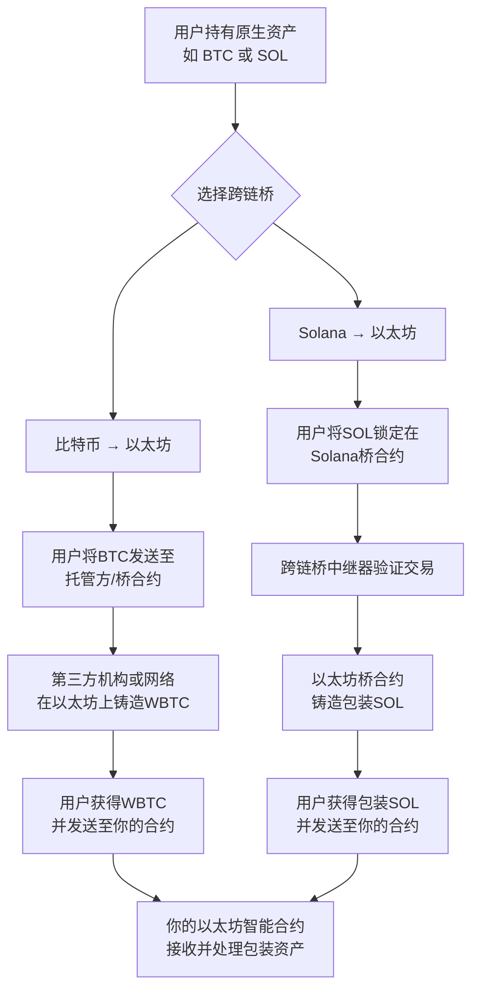

```mermaid
flowchart TD
    A[用户持有原生资产<br>如 BTC 或 SOL] --> B{选择跨链桥}
    
    B --> C[比特币 → 以太坊]
    B --> D[Solana → 以太坊]
    
    C --> E[用户将BTC发送至<br>托管方/桥合约]
    E --> F[第三方机构或网络<br>在以太坊上铸造WBTC]
    F --> G[用户获得WBTC<br>并发送至你的合约]
    
    D --> H[用户将SOL锁定在<br>Solana桥合约]
    H --> I[跨链桥中继器验证交易]
    I --> J[以太坊桥合约<br>铸造包装SOL]
    J --> K[用户获得包装SOL<br>并发送至你的合约]
    
    G & K --> L[你的以太坊智能合约<br>接收并处理包装资产]
```